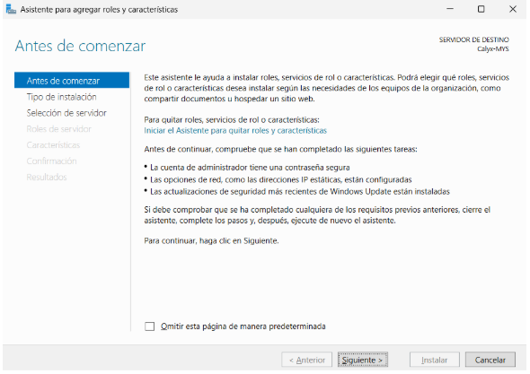
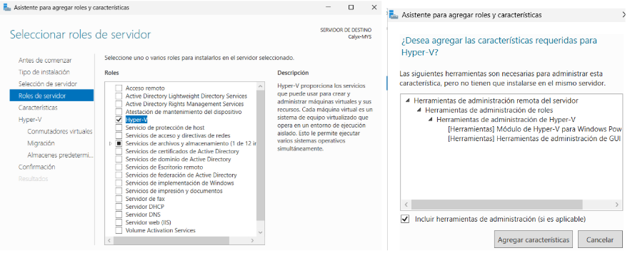
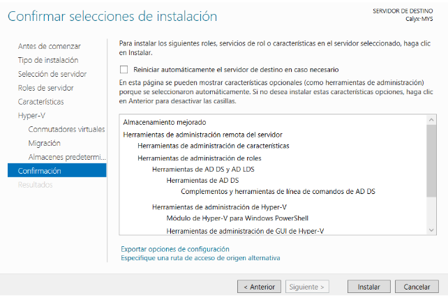
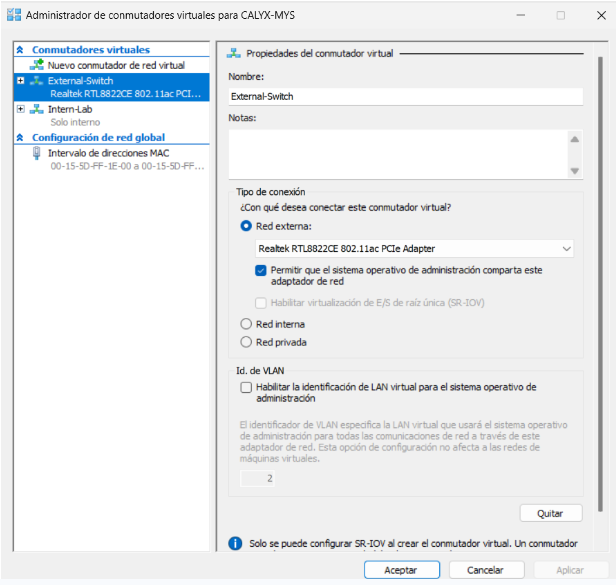

# 2. Instal·lació i Configuració Inicial

## Instal·lació de Hyper-V a Windows Server 2025

### Pas 1: Obrir l'Administrador del servidor

Accedim a l'**Administrador del servidor** i seleccionem "Afegir rols i característiques".

### Pas 2: Seleccionar tipus d'instal·lació

Escollim **"Instal·lació basada en característiques o en rols"**.

### Pas 3: Seleccionar el servidor

Seleccionem el servidor on volem instal·lar Hyper-V.

### Pas 4: Marcar i instal·lar Hyper-V

Marquem la casella **Hyper-V** i acceptem la instal·lació de les eines de gestió.

### Pas 5: Seleccionar l'adaptador de xarxa

Escollim l'adaptador de xarxa disponible (només n'hi ha 1).

### Pas 6: Reiniciar el sistema

Un cop finalitzada la instal·lació, **reiniciem el servidor**.

## Configuració inicial de Hyper-V

### Creació del Virtual Switch extern

1. Obrim **Hyper-V Manager**
2. Accedim a **Virtual Switch Manager**
3. Creem un **New Virtual Network Switch** de tipus **External**
4. Li assignem el nom `External-Switch` i seleccionem l'adaptador físic

### Configuració de carpetes

Definim la ruta dels discos i màquines virtuals:

- **Discos virtuals:** `C:\HyperV\Virtual Hard Disks\`
- **Configuracions:** `C:\HyperV\Virtual Machines\`
- **ISOs:** `C:\HyperV\ISO\`

Utilitzem la ubicació per defecte perquè millora el rendiment, facilita còpies de seguretat i evita corrupció del sistema.

### Activació del servei Hyper-V Host Compute Service

Verifiquem que el servei estigui actiu per al correcte funcionament de les VMs.
