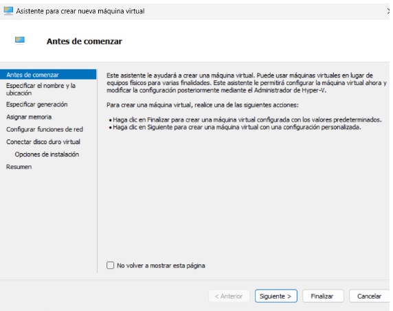
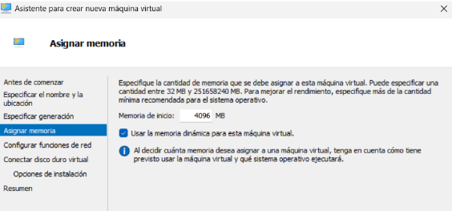
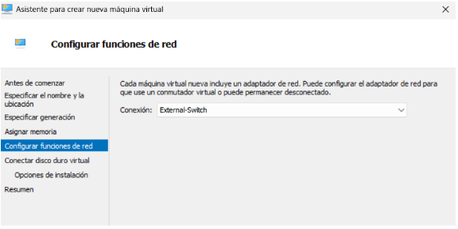
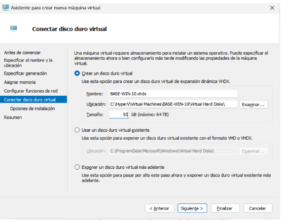
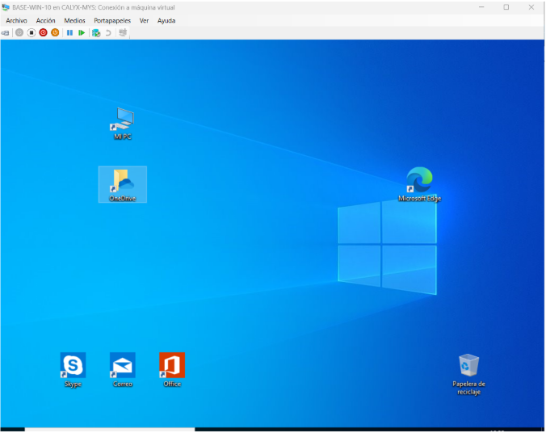

# 3. Desplegament de la Màquina Virtual Base

## Disseny previ de la VM

| Paràmetre | Valor | Per què? |
|-----------|-------|----------|
| Nom | BASE-WIN-10 | Nom clar per identificar la màquina base |
| SO | Windows 10 Pro | Sistema estable per a proves |
| RAM | 4 GB | Suficient per a un servidor base amb rols bàsics |
| Disc | 50 GB (VHDX dinàmic) | Permet sistema, actualitzacions i rols sense quedar curt |
| Xarxa | External-Switch | Accés a Internet i LAN física |

## Creació de la VM a Hyper-V

### Pas 1: Obrir l'assistent de nova màquina virtual

Hyper-V Manager → clic dret sobre el servidor → New → Virtual Machine

### Pas 2: Assignar nom i ubicació

- **Nom:** BASE-WIN-10
- **Ubicació:** `C:\HyperV\Virtual Machines\`

### Pas 3: Seleccionar generació

Escollim **Generation 2** (suporta UEFI, Secure Boot i millores modernes).

### Pas 4: Configurar la memòria

- **RAM inicial:** 4096 MB
- **Memòria dinàmica:** Activada

### Pas 5: Assignar la xarxa

Seleccionem `External-Switch` com a connexió.

### Pas 6: Configurar el disc dur virtual

- **Nom:** `BASE-WINDOWS-10.vhdx`
- **Ubicació:** `C:\HyperV\Virtual Hard Disks\`
- **Mida:** 50 GB
- **Tipus:** VHDX dinàmic

### Pas 7: Instal·lar el sistema operatiu

Inserim la ISO de Windows 10 i iniciem la VM per procedir amb la instal·lació.

### Pas 8: Verificar que la VM està engegada

