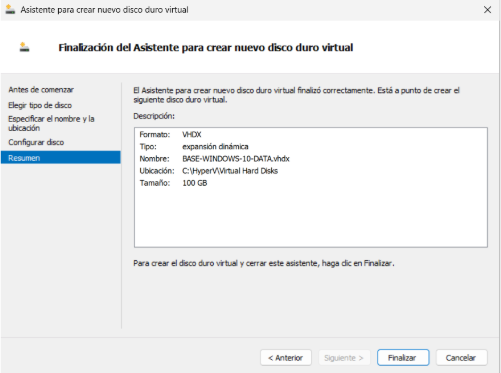
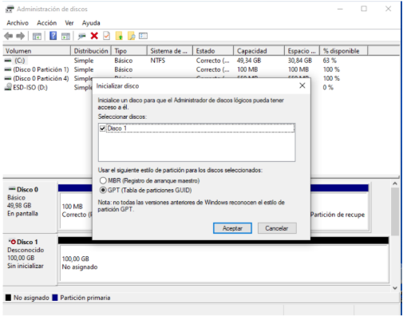
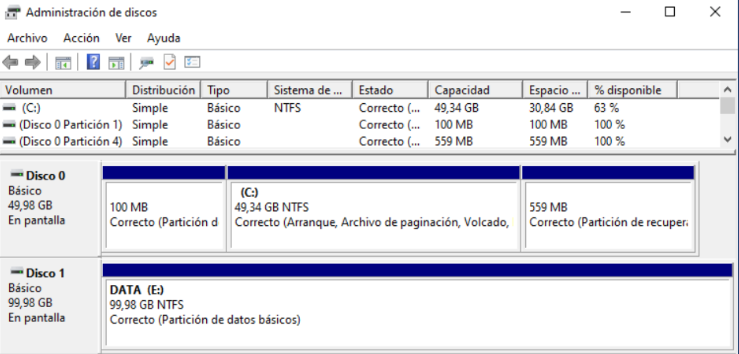

# 5. Implementació d'Emmagatzematge

## Estructura d'emmagatzematge del host

| Ruta | Contingut |
|------|-----------|
| `C:\` | Sistema operatiu del host (Windows Server 2025) |
| `C:\HyperV\Virtual Machines\` | Fitxers de configuració de les VM |
| `C:\HyperV\Virtual Hard Disks\` | Discos virtuals (VHDX) de les VM |
| `C:\HyperV\ISO\` | Imatges ISO |

**Per què aquesta estructura?**
- Separar sistema i VM millora el rendiment
- Facilita les còpies de seguretat
- Carpetes clares permeten identificar ràpidament on és cada cosa

## Tipus de discs virtuals utilitzats

Utilitzo **VHDX dinàmic** per totes les VM:
- Creix a mesura que la VM utilitza espai
- Ideal per a laboratori i entorns de prova
- Més modern i resistent a corrupció que VHD

## Disc del sistema de BASE-WINDOWS-10

- **Nom:** `BASE-WINDOWS-10.vhdx`
- **Ubicació:** `C:\HyperV\Virtual Hard Disks\`
- **Mida:** 50 GB
- **Tipus:** VHDX dinàmic

Aquest disc conté:
- El sistema operatiu Windows 10
- Programes bàsics
- Configuració inicial

## Afegir un segon disc virtual de dades

Per separar sistema i dades, he afegit un disc de dades a la VM:

1. **Obrir configuració de la VM** → Afegir disc dur
2. **Tipus de disc:** Expansió dinàmica
3. **Ubicació:** `C:\HyperV\Virtual Hard Disks\BASE-WINDOWS-10-DATA.vhdx`
4. **Mida:** 100 GB

### Configuració del disc dins de Windows 10

1. Obrir **Disk Management** (`diskmgmt.msc`)
2. Detectar el nou disc com a "Not initialized"
3. Inicialitzar-lo (GPT)
4. Crear **New Simple Volume**
5. Assignar lletra `E:\`
6. Format NTFS i nom `DATA`

