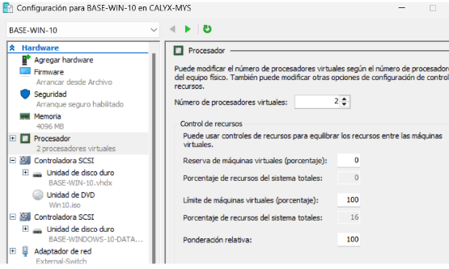
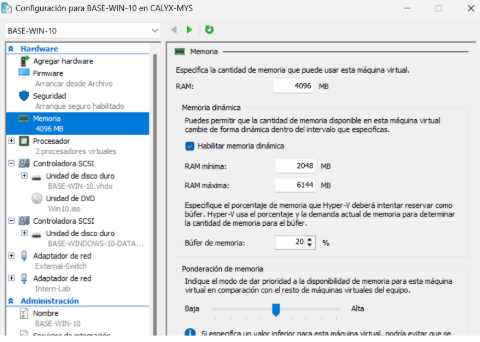

# 6. Configuració de Recursos

## Visió global dels recursos del host

| Component | Capacitat |
|-----------|-----------|
| CPU | 6 cores |
| RAM | 32 GB |
| Disc | SSD |

## Objectiu

Repartir aquests recursos entre les VM de manera que:
- El host sempre tingui marge per funcionar bé
- Les VM tinguin prou recursos per al seu rol

## Estratègia general d'assignació de recursos

| VM | vCPU | RAM | Disc |
|----|------|-----|------|
| **BASE-WINDOWS-10** | 2 | 4 GB (dinàmica) | 64 GB sistema + 100 GB dades |
| **CLIENT-1** | 1 | 2 GB (dinàmica) | 40-60 GB |

**Per què aquesta assignació?**
- La màquina base necessita més recursos perquè pot fer de referència, servidor o plantilla
- Els clients poden treballar amb menys recursos perquè només executen tasques lleugeres

## Configuració de CPU

Des de la configuració de la VM → Processador → Assignar 2 vCPU

## Configuració de RAM

Des de la configuració de la VM → Memòria:
- **RAM inicial:** 4096 MB
- **RAM mínima:** 2048 MB
- **RAM màxima:** 8192 MB
- **Memòria dinàmica:** Activada

## Configuració d'emmagatzematge

Des de la configuració de la VM → Controlador IDE/DVD → Inserir ISO per a la instal·lació

## Verificació i ajust dels recursos

Un cop creada la VM, verifiquem que els recursos assignats són correctes i en cas necessari els ajustem segons el rendiment observat.
